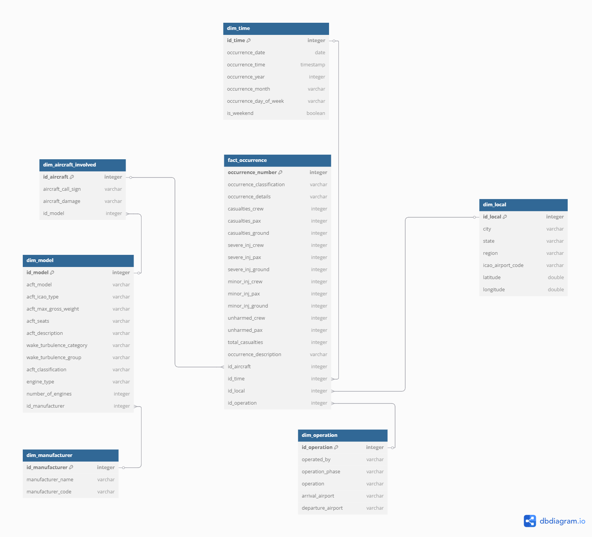

# 🛬 Data Lakehouse de Ocorrências Aeronáuticas no Espaço Aéreo Brasileiro

Este projeto tem como objetivo a construção de um Data Lakehouse utilizando dados abertos da **ANAC**, relacionados a ocorrências de acidentes e incidentes graves no espaço aéreo brasileiro.
A fonte principal é o [portal de dados abertos da ANAC](https://www.gov.br/anac/pt-br/acesso-a-informacao/dados-abertos), que disponibiliza diversas informações sobre a atividade aérea brasileira.
A fim de enriquecer os dados obtidos, foram desenvolvidos scripts de **web scraping** com as bibliotecas `requests`, `selenium` e `BeautifulSoup`, que coletam informações diretamente do site oficial da **ICAO (International Civil Aviation Organization)**.

---

## 🔗 Fontes

- [Portal de Dados Abertos da ANAC - Segurança Operacional](https://www.gov.br/anac/pt-br/acesso-a-informacao/dados-abertos/areas-de-atuacao/seguranca-operacional/ocorrencias-aeronauticas)  
- [Repositório de Scraping: ICAO Designators e Aircraft Types](https://github.com/filipesag/icao-designators-acft-types)

---

## 📐 Modelagem Dimensional

Para facilitar análise futura, foi criado um modelo dimensional Snowflake.

  

---

